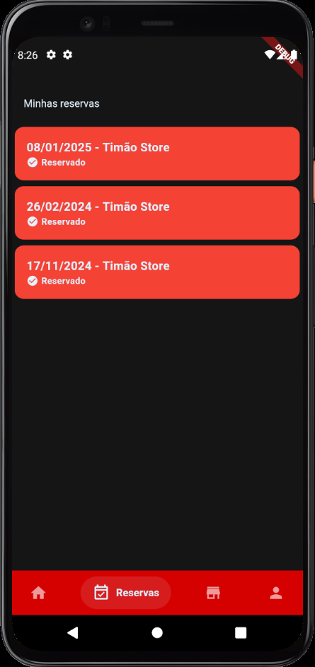

# Seat Scheduler App

**Seat Scheduler App** é o aplicativo móvel desenvolvido em **Flutter** e **Dart** que permite aos usuários visualizar e gerenciar suas reservas em restaurantes. Com uma interface intuitiva, os usuários podem explorar lojas, reservar mesas, visualizar suas reservas e editar informações de perfil diretamente no app.

## Tecnologias Utilizadas
- **Flutter** - Framework para construção de aplicativos multiplataforma.
- **Dart** - Linguagem de programação moderna e eficiente.
- **Salomon Bottom Bar** - Para navegação prática e amigável.
  
## Funcionalidades
- **Visualizar Lojas**: Explore todas as lojas disponíveis para realizar reservas.
- **Marcar Reservas**: Escolha a loja e a mesa, e reserve no horário desejado.
- **Ver Reservas**: Acompanhe todas as suas reservas feitas diretamente pelo app.
- **Perfil do Usuário**: Veja e edite suas informações de perfil, como nome, e-mail e senha.
- **Alterar Dados**: Atualize seus dados de forma rápida e fácil, diretamente no app.

## Estrutura do App
- **Home**: Lista de lojas disponíveis para realizar reservas.
- **Reservas**: Visão completa das reservas feitas, com opções de cancelamento.
- **Perfil**: Informações do usuário com opção para editar dados.

## Imagens do Aplicativo

### Login

### Página de home

### Página de Lojas

### Página de Reservas

### Perfil do Usuário

### Perfil do menu

